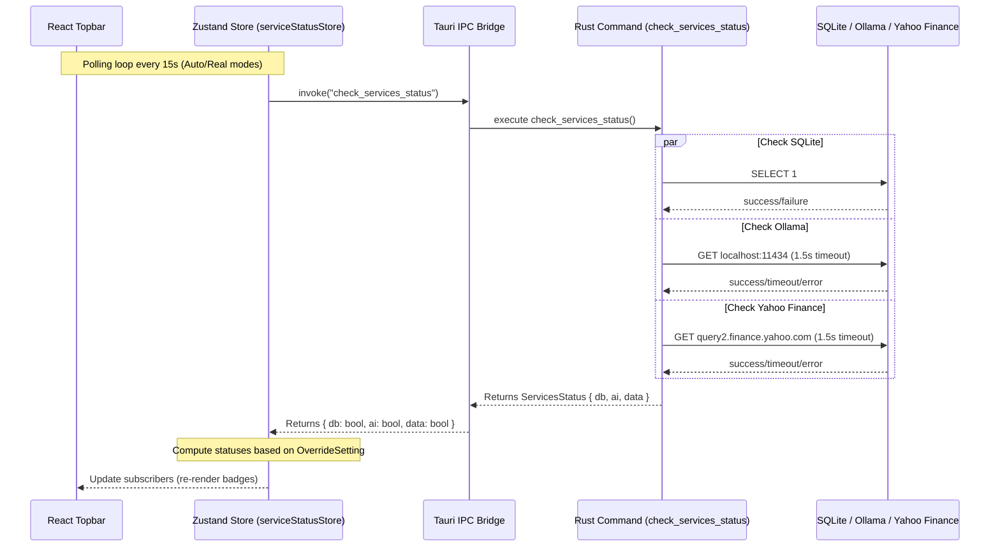

# Technical Design: Service Status Indicator

This document describes the technical architecture and implementation plan for visualising backend service connectivity in Ticker Tape.

## Technical Approaches & Decisions

### 1. Asynchronous Concurrent Backend Probes
The Rust backend Tauri command `check_services_status` probes three services concurrently without blocking:
- **SQLite DB**: Executes a lightweight query `SELECT 1` against the global connection pool `DB_POOL`.
- **Ollama AI**: Performs an HTTP `GET` request to `http://localhost:11434`.
- **Yahoo Finance DATA**: Performs an HTTP `GET` request to `https://query2.finance.yahoo.com`.

The probes run concurrently using `tokio::join!`. The HTTP checks use a custom `reqwest::Client` configured with a strict `1.5-second` timeout (`connect_timeout` and `timeout`) to prevent network hang-ups.

### 2. Decisions Table

| Decision | Option Chosen | Rationale |
| :--- | :--- | :--- |
| **Concurrency model** | `tokio::join!` | Runs all probes in parallel, avoiding sequential timeout accumulation (e.g. up to 3s). |
| **Ollama endpoint** | `http://localhost:11434` (GET) | Direct connection request to verify port binding and service status. |
| **Yahoo Finance endpoint** | `https://query2.finance.yahoo.com` (GET) | Validates external connection to the Yahoo Finance API host with minimal data payload. |
| **State Resolution Location** | Frontend Zustand Store | Simplifies the Rust command (returns raw status) while centralising fallback logic ("Auto" mock conversion) in the UI state manager. |

## Data Flow



## Interfaces & Contracts

### Rust Command (src-tauri/src/lib.rs)
```rust
#[derive(Debug, Clone, serde::Serialize, serde::Deserialize)]
pub struct ServicesStatus {
    pub db: bool,
    pub ai: bool,
    pub data: bool,
}

#[tauri::command]
pub async fn check_services_status() -> Result<ServicesStatus, String>;
```

### TypeScript Store (src/store/serviceStatusStore.ts)
```typescript
export type ServiceStatus = 'connected' | 'mock' | 'disconnected';
export type OverrideSetting = 'Real' | 'Mock' | 'Auto';

export interface ServiceStatusState {
  status: {
    db: ServiceStatus;
    ai: ServiceStatus;
    data: ServiceStatus;
  };
  override: OverrideSetting;
  setOverride: (override: OverrideSetting) => void;
  pollStatus: () => Promise<void>;
}
```

## File Changes

| File | Action | Description |
| :--- | :--- | :--- |
| `src-tauri/src/lib.rs` | Modify | Implement `check_services_status` command using concurrent tokio tasks and register it. |
| `src/store/serviceStatusStore.ts` | Create | Implement Zustand store with override state resolution, 15s interval polling, and storage persistence. |
| `src/shell/topbar.tsx` | Modify | Integrate Zustand store. Render badges for DB, AI, and DATA, plus override dropdown. |

## Testing Strategy

| Target | Framework | Approach |
| :--- | :--- | :--- |
| **Backend Probes** | `cargo test` | Unit test DB query and external HTTP mock checks. |
| **Zustand Store** | `Vitest` | Test state resolution for `"Real"`, `"Mock"`, and `"Auto"` settings and mock the Tauri IPC boundary. |
| **UI Badges** | `Vitest` / RTL | Verify badge states render checkmark (`✓`), tilde (`~`), or cross (`✗`) and appropriate classes/colors. |
